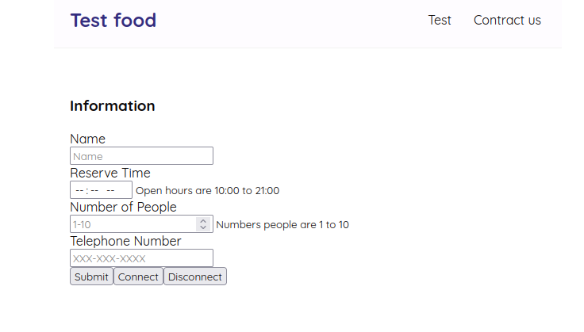
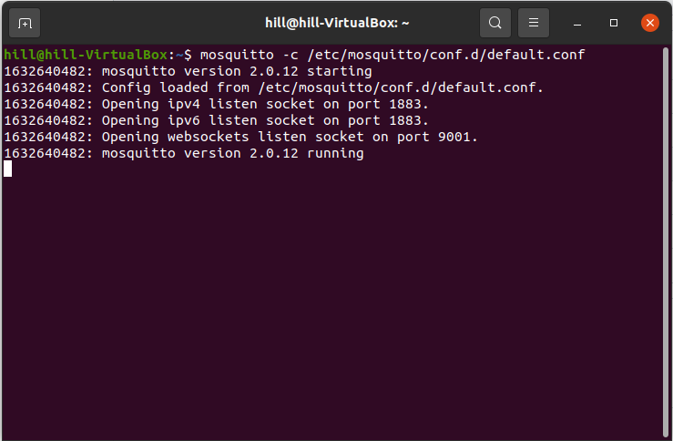
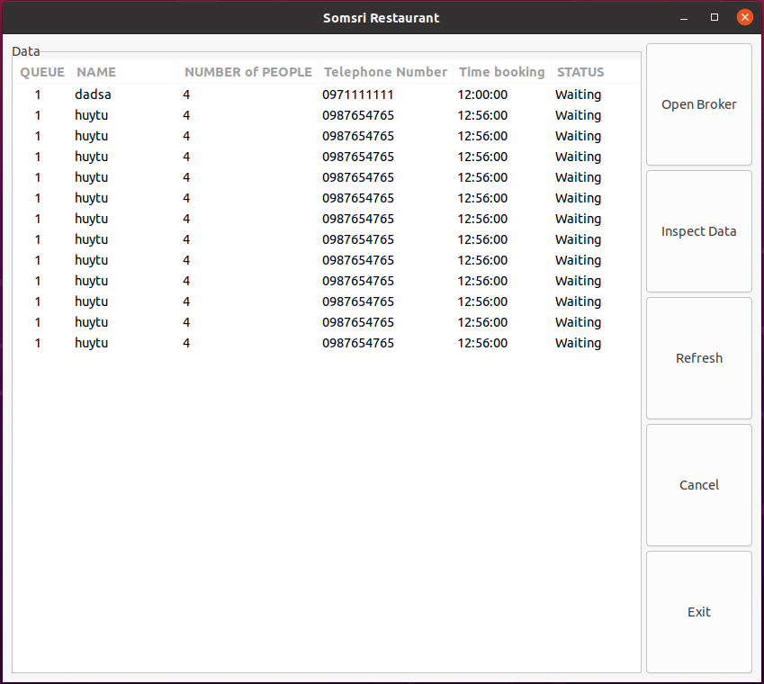
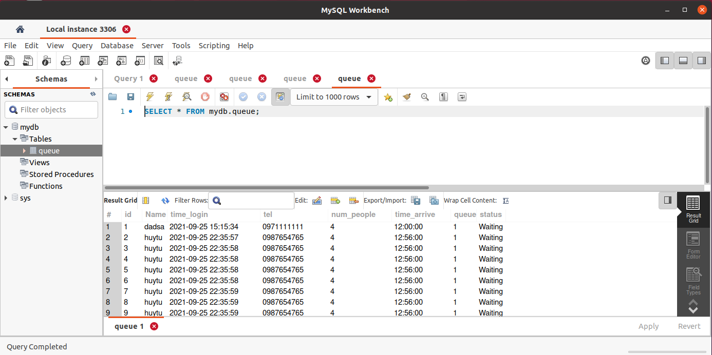

# Week1
The main goals of this week are:
  - Implementing mosquitto broker setup to create our own broker that enabled websocket function.
  - Create frontend for the website to send some JSON data for testing.
  - Connecting the frontend, backend and database by sending some JSON from frontend to backend.
  
# Report for Frontend
We decide to use Reactjs as a library for frontend development because it make for building single page application that suit to our project well. And we are using MQTT.js module that already support MQTT over Websocket so it make things easy to implement because we just specify in connect option that we want to use websocket and change the URL to websocket protocal(Ex. ws://localhost:port).We are using the form tag to create form and submit it. Then change the data to JSON data and change it to string(mqtt only support sending messages) then publish it through mqtt.

the result:

# Report for Backend
**Set up mosquitto broker**

We decide to setup our own broker to keep this project as private.

Step 1: Install msoquitto following this instruction :http://www.steves-internet-guide.com/install-mosquitto-linux/  *Note: we use broker on linux

Step 2: Go to /etc/mosquitto/conf.d and then create file name default.conf that include this commands

  - listener 9001
  - protocol websocket
  - listener 1883
  - protocol mqtt

Then save the file. So now when we want to open the broker use this command in terminal.

  - mosquitto -c /etc/mosquitto/conf.d/default.conf

Then the terminal will look like this.

Step 3: Don't close the terminal unitil you finish using the broker.
Step 4: We want to connect to external computer so we use Hamachi to create virtual lan.

to install Hamachi in linux following this step : https://haguichi.net/download/

Step 5: Open the Hamachi and add any external computer user to Hamachi server.

Step 6: Now every external user can connect to the broker by using this URL ws://broker's_hamachi_virtual_ipv4:9001 to connect to the broker.

**Backend side**
We use Paho mqtt for subscribe data from broker, JSON-C library for JSON data, Mysql for database and GTK3 for backend GUI.
In backend.c you will find that we use message callback function of Paho mqtt to split the JSON data and write the data to Mysql database.
And the database generate unique ID automatically along with the time_login that is the time when the data has written in database.

For GUI, right now we can refresh the data to read data from database and show them on GUI and we can use exit button to close the program.

**Conclusion**
We have created frontend and backend of the website that can send data through each other and write the data to the database.
the result:

