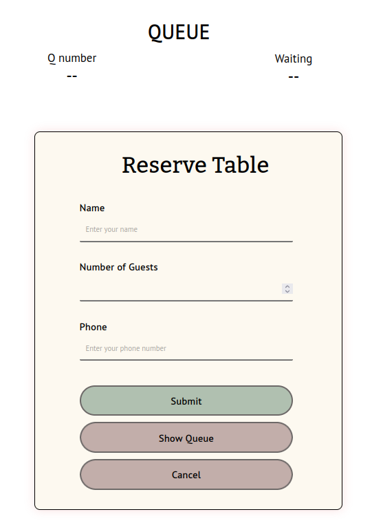
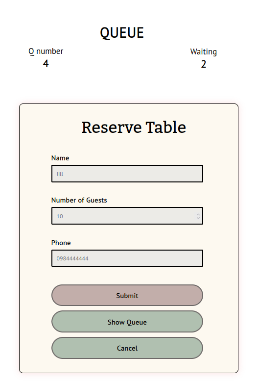
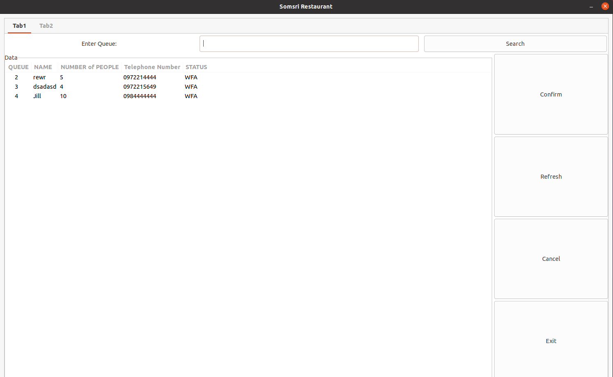
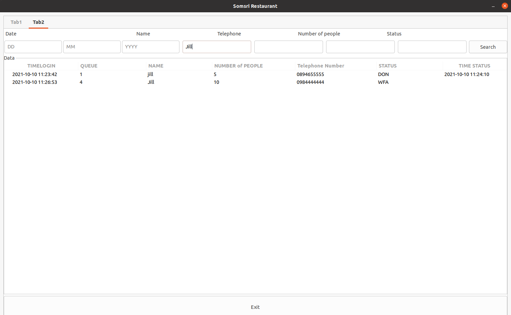

# Week3
The main goals of this week are:
  - Calculate the remaining queue.(old goal)
  - Sending queue number and remaining queue back to frontend.(old goal)
  - Realtime remaining display.
# Major change
  - Create showR topic for real time data that everyone can receive (remaining queue before user submit).
    
# Report for Frontend
Change some design and implement some features such as

  - All entry required befor submitting.
  - Submit button can only click once  then it will block the entry. You can only click cancel button to cancel the reservation.
  - Can recieve real time data but can't display.
  - Can recieve data from backend.
  - Using localstorage to save the state and some datas for user.
  
 Right now frontend side not fully functional there are some features that we can't do and there are some bugs too.
 

# Report for Backend
We can sending real time data by using multithread to checking remaining queue for every queue that are in WFA status.

The idea behind calculate the remaining queue is count from database how many queue before the queue that we want to check.

**GUI**

Change some design and add the protection for fault input that leads to bug in program.

**NOTE: if we change to fullscreen mode all label will be in the correct position.

# Conclusion

For backend side, all main features are almost done. We will test all the features in the future.

For frontend side, can recive datas (real time and not real time datas) but all display function not work properly.

The main features that not finished are cancel by user and sending warning to user when their queue are in the fifth position of all the queue
