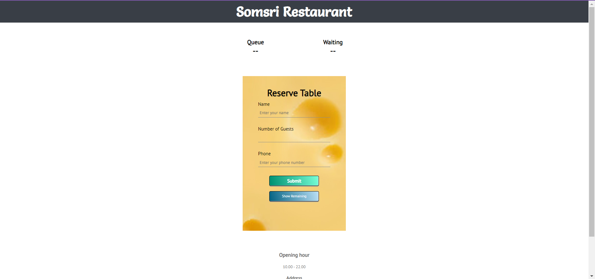
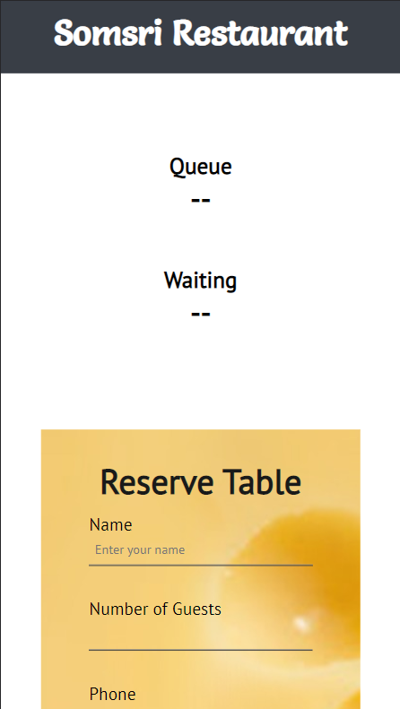
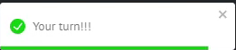
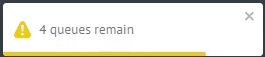
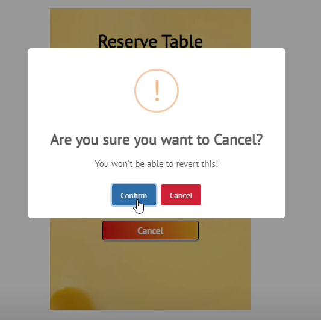
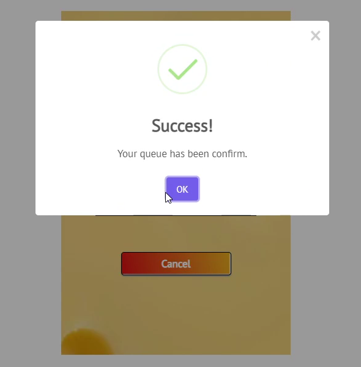
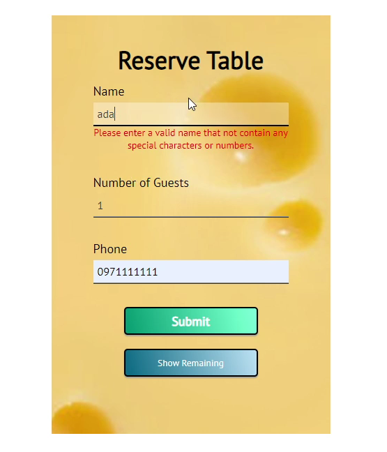
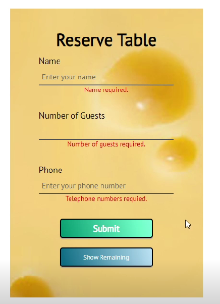
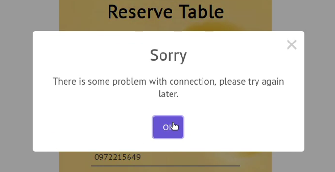
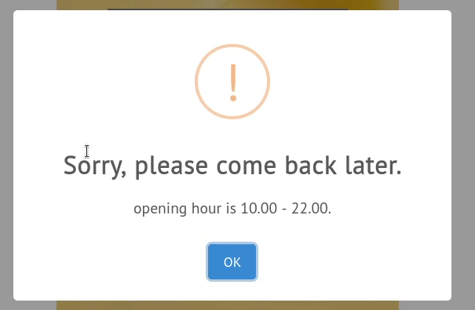

# Week4&5
 The main goals of this week are:
  - Auto refresh for cancelling from client.
  - Make frontend website be responsive.
  - Clear all the bugs.
  - Validation check for website input.
  
# Major change
  - Change topics name such as from 'test' to 'request' and from 'showR' to 'recent_remaining'.
# Report for Frontend
 We have made website to be responsive by using Media query method in CSS.
 
 
 
 
 We use react-toastify for notification when the remaining is between  0 <= remaining <= 4 , to tell the clients that they are almost their queue.
 And we use sweetalert2 for all pop-ups such as confirmation and alert something.
 
 react-toastify : https://www.npmjs.com/package/react-toastify
 
 sweetalert2 : https://sweetalert2.github.io/
 
 *All images that shown below just some samples of all notifications and pop-ups
 
 
 
 
 
 
 
 We have created validation check for input. 
 - Name entry can only enter the charactors with no special charactors and number.
 - Number of Guests entry can only enter number between 1 to 10.
 - Phone entry can only enter 10 digit numbers.

 
 
 
 And finally, we have use pop-ups to show that clients are have some connection problems or the restaurant are not available.
 Clients can enter the informations then when they click the buttons, pop-ups will shown.
 
 
 
 
 
 
 
 
 
 
