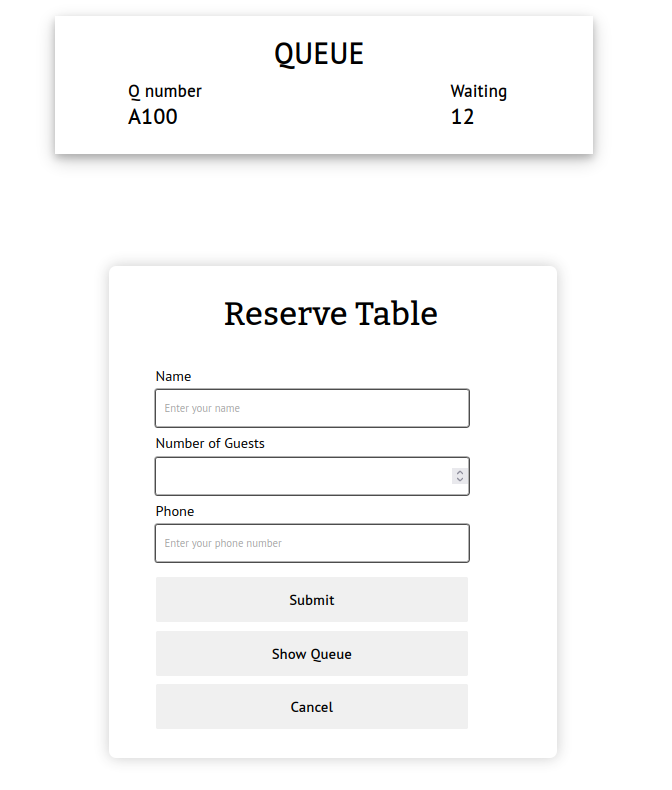
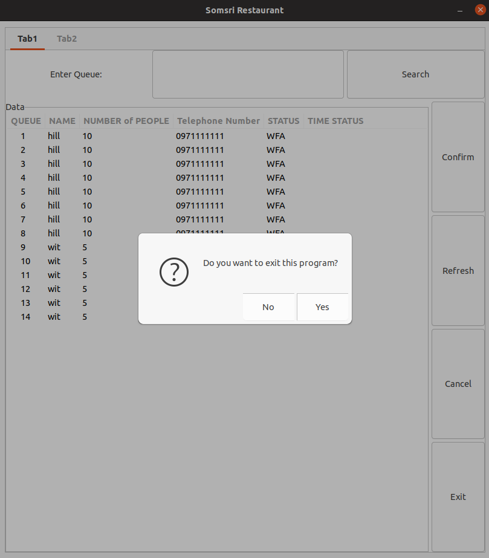
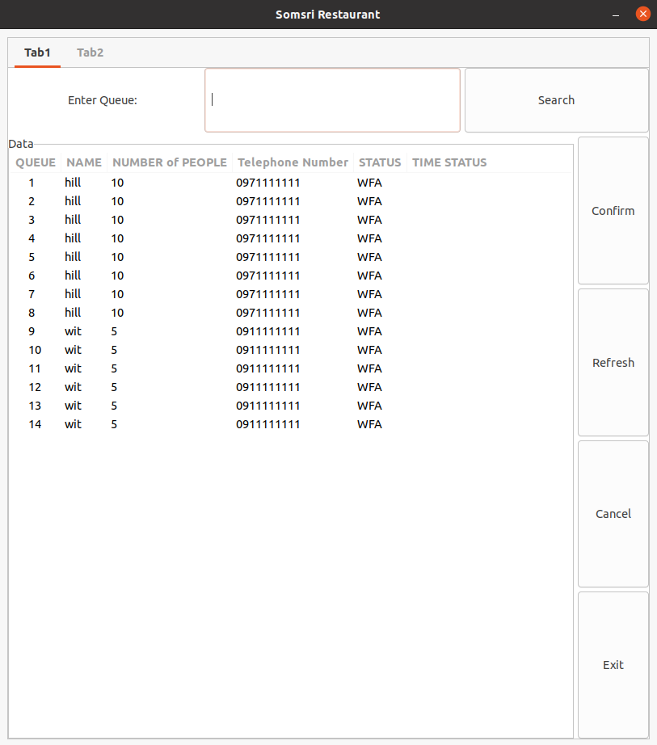
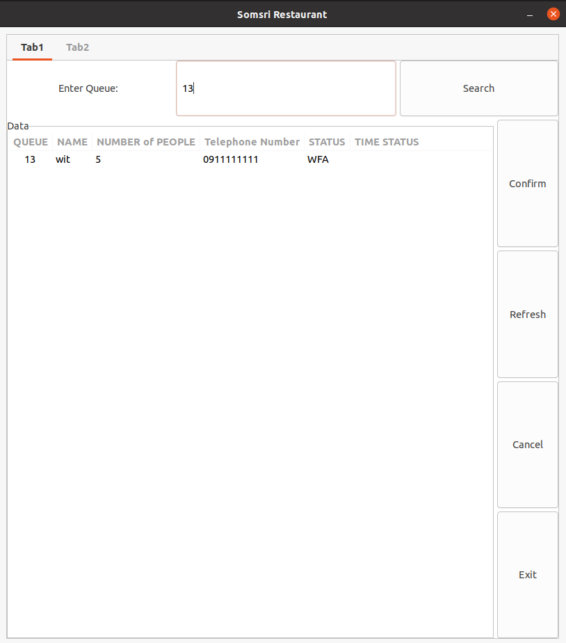
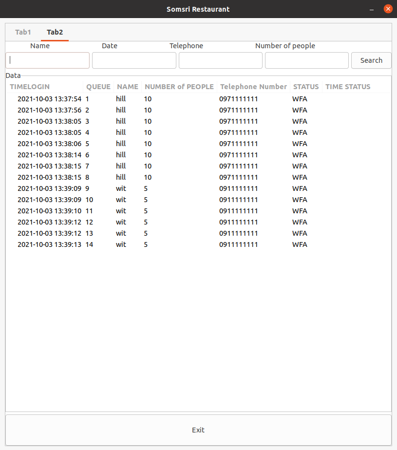
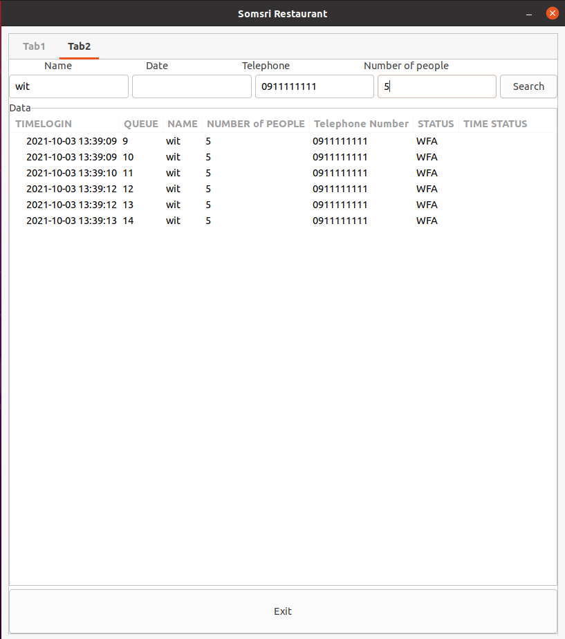
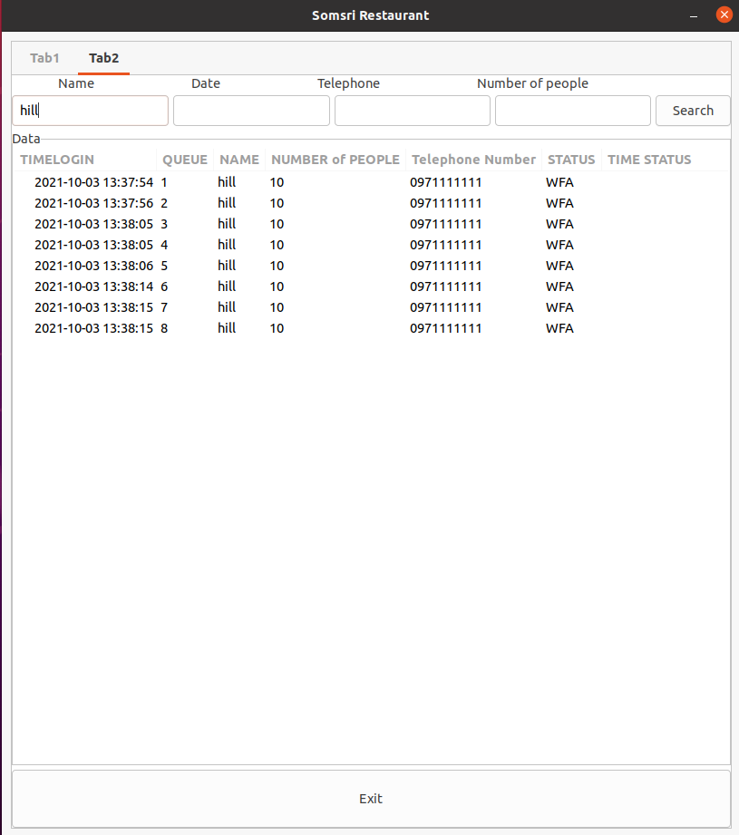

# Week2
The main goals of this week are:
  - Generating queue number and save it into database.
  - Calculate the remaining queue.
  - Sending queue number and remaining queue back to frontend.

# Major change
  - Delete reserve time in both frontend and backend including in database.
  - Use 3 alphabets to represent the status WFA = Waiting for admin or Pending, CBA = Cancle by admin, CBC = cancle by client, DON = Done or confirm the queue.
  - Changing the main process to client can only cancle the queue and the restaurant can confirm and cancel the queue to make sure that the client will come to the restaurant.
  - Adding time_status in the database for record the time when confirm or cancel that are mean that is the end of all process for that queue.
  
# Report for Frontend
Redesign the UI to make it show queue number and remianing number (Does not implementing pub and sub in this frontend) and make it work on both in computer and mobile.
And we decide to delete the reserve time because it's not in our concept work.

# Report for Backend
**Queueing system**

We can generate queue number by using the recent queue in database then add 1 to it but right now we can't reset the queue when the data skip the day.
And we can't calculate the remaining queue right now.

**Broker**

We use shell script to open and close mqtt broker when the program open broker will open and when the program close broker will close too.
But the problem about using shell script is it require full path to the shell script file.

**GUI**

We decide to create 2 tabs, the first tab is about handling queue in a day and the second tab is about inspect the datas in database.
Both of 2 tabs use listbox and display as table like in database and you can select a row by click on it and if the datas are too may the list box have a scrollbar. And the gui have exit button on both tabs that when you click on it, it'll ask you to ensure the exit.

*First tab*:

In this tab, we read the data specific for the day we open the program. It can display the current data that already update into database without to mannually refresh but if there are some datas that are already in the database with the same date as the day you open the program, you can use refresh button to show them all.

You can search by queue number to find the data of that queue by tying queue number in search entry and click search.

You can cancel the queue and confirm the queue by select the row and clik cancel button or confirm button then the status of that queue will change to CBA (cancle by admin) and DON (Done). The queue data that show on the table it will show only the status is WFA (Waiting for admin) so if you cancle or confirm the queue it will dissappear from table(but you can inspect them in the second tab).

*Second tab*:

In this tab, like the first tab but it can only inspect the data by searching by Name,Date,Tel,Number of people (right now search by date can't use). If you do not enter anything in search entry and click search button, it'll show all the data in database. But this tabs not support auto refresh so you need to click refresh button if you want to inpect the datas.

# Conclusion
We have redesign the frontend to prepare for the future features.

We can generate the queue number but we can't calculate the remaining queue and send both of them back to front end.

We add some features for backend GUI such as Searching, Multiple tabs, Auto refresh.

So in this week we complete only 1 main goal but we work on minor goal instead because the main goals take alot of time for researching. 

