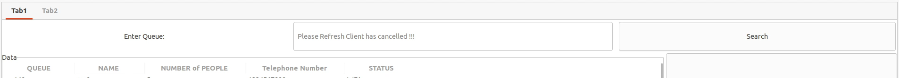

# Week4&5
 The main goals of this week are:
  - Auto refresh for cancelling from client.
  - Make frontend website be responsive.
  - Clear all the bugs.
  - Validation check for website input.
  
# Major change
  - Change topics name such as from 'test' to 'request' and from 'showR' to 'recent_remaining'.
# Report for Frontend
 We have made website to be responsive by using Media query method in CSS.
 
 
 
 
 We use react-toastify for notification when the remaining is between  0 <= remaining <= 4 , to tell the clients that they are almost their queue.
 And we use sweetalert2 for all pop-ups such as confirmation and alert something. And after restaurant cancel or confirm client queue the website will clear all localstorage and refresh the webpage. 
 
 react-toastify : https://www.npmjs.com/package/react-toastify
 
 sweetalert2 : https://sweetalert2.github.io/
 
 *All images that shown below just some samples of all notifications and pop-ups
 
 
 
 
 
 
 
 We have created validation check for input. 
 - Name entry can only enter the charactors with no special charactors and number.
 - Number of Guests entry can only enter number between 1 to 10.
 - Phone entry can only enter 10 digit numbers.

 
 
 
 And finally, we have use pop-ups to show that clients are have some connection problems or the restaurant are not available.
 Clients can enter the informations then when they click the buttons, pop-ups will shown.
 
 
 
 
 
# Report for Backend

We can't implement real time display on GUI when client sent cancel request so whenever you want to do something you need to refresh first and we implement some message on seacrh entry in tab1 that show the text to tell you that you recieved cancel request please refresh the GUI.

And what if you don't refreshing and you confirm or cancel the queue that already cancelled the GUI will not do anything. Normally, it will cancel and refresh automatically but if there is some problem with queue it won't do anything even when you search and try to confirm and cancelled the queue that is not in WFA status.
 

# Conclusion

For backend side, all main features are done. We still searching for bugs and some feature such as real time refresh for cancel request can't be done because we don't have much time for that and we have to change a lot of things that will cause some bugs in the future so we decided to use refresh button instead.

For frontend side, we decorate the webpage and fixing some bugs but we think that there are some bugs on webpage so we will searching for that.

The reason we merger week4 and week5 together because this project is time consuming in week4 we fixing things so the project is not going forward then in week5 we testing and make the project look good.

And now this is Version 1 of our project.
 
 
 
